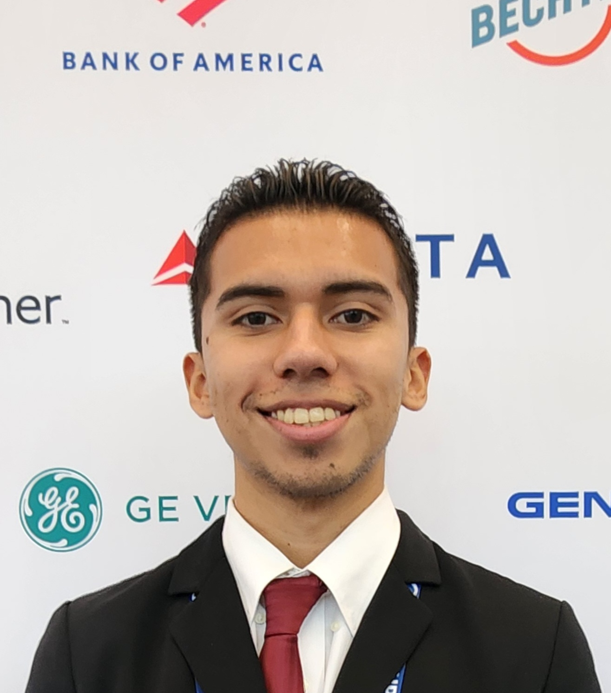

  

<h1 align="center">Hi there, I'm Marc Romero 👋</h1>

---

## 👨‍💻 About Me

I'm a fourth-year Computer Engineering student studying at the University of California, Santa Cruz.  
I'm working toward becoming a Digital Hardware Engineer. I enjoy working on embedded systems, 
designing digital logic, and exploring how hardware and software interact at the lowest levels.
I'm currently a Break Through Tech AI Fellow, where I’ve gained knowledge in machine learning and exposure to real-world AI applications. 
I also serve as the Events Coordinator for my SHPE chapter at UCSC, where I help organize workshops, panels, and networking events to support Latino students in STEM.
I'm very passionate about building impactful technology and uplifting my community along the way.

---

## 📖 Featured Project: Fall AI studio project
Coming soon!

---

## 🛠 Tech Stack

Languages: 

Data Science & ML: 

Tools: 

Hardware/Embedded: 

<!-- Add or remove as needed -->

---

---

## 🚀 Key Projects

### 🧠 Machine Learning Foundations: Final Project
Built a neural network to predict whether book reviews are positive or negative using TF-IDF vectorization and Keras.
Tuned hyperparameters to improve accuracy and evaluated the model using metrics like loss, accuracy, and the ROC curve.
Gained hands-on experience applying machine learning to real-world text data.
🔗 [GitHub Repo](https://github.com/MarcRomero16/My-eCornell-Portfollio)

---

## 📬 Contact Me

- 📧 [marcromero2022@gmail.com](mailto:marcromero2022@gmail.com)
- 💼 [LinkedIn](https://www.linkedin.com/in/marc-romero-3404b2291/)

---

## 🏆 Awards & Certifications

- 📜 Dean's Honors List (2022-Present) – UCSC
- 🔖 Machine Learning Foundations Certificate – Cornell University

---
<!--
**MarcRomero16/MarcRomero16** is a ✨ _special_ ✨ repository because its `README.md` (this file) appears on your GitHub profile.

Here are some ideas to get you started:

- 🔭 I’m currently working on ...
- 🌱 I’m currently learning ...
- 👯 I’m looking to collaborate on ...
- 🤔 I’m looking for help with ...
- 💬 Ask me about ...
- 📫 How to reach me: ...
- 😄 Pronouns: ...
- ⚡ Fun fact: ...
-->
